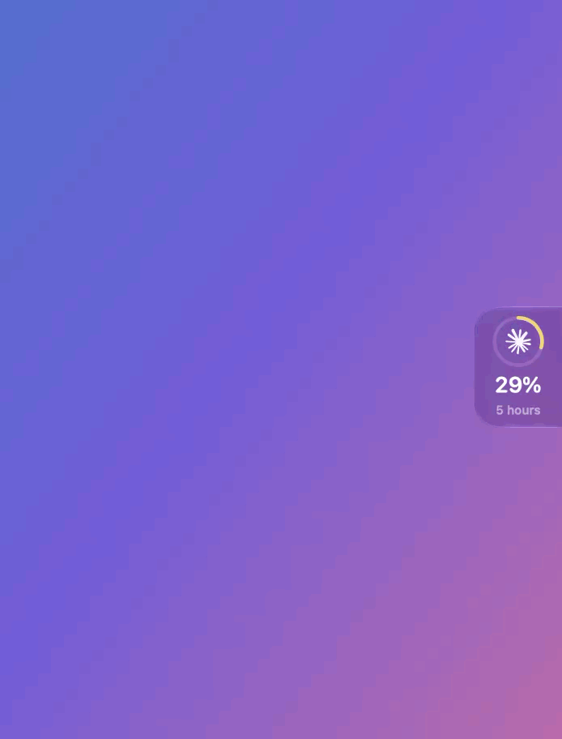

# Usage Island

[](https://github.com/LikanLabs/UsageIsland/actions/workflows/ci.yml)
[](https://github.com/LikanLabs/UsageIsland/releases/latest)
[](https://www.apple.com/macos/)
[](https://www.swift.org/)
[](LICENSE)

**Your Codex and Claude Code limits, always one glance away.**

<p align="center">
  
</p>

Usage Island is a small native macOS app that sits beside the MacBook notch
(or on the left or right edge of the screen) and shows how much of your
subscription limits you have left:

- **Codex**: 5-hour session and weekly limits, plus any separately named
  limit your plan has. Plans without a 5-hour limit show "No limit".
- **Claude Code**: 5-hour session, weekly and per-model weekly limits (for
  example "Fable week"), the same numbers `/usage` shows.

The pill shows the tool you are using right now. Click it to see both tools,
with reset times.

No account, no server and no telemetry. Usage Island reuses the Codex and
Claude Code CLIs you already have signed in and never reads their credentials.

## Contents

- [Install](#install)
- [Update](#update)
- [Use](#use)
- [How it gets your usage](#how-it-gets-your-usage)
- [Uninstall](#uninstall)
- [Troubleshooting](#troubleshooting)
- [Development](#development)
- [Releases](#releases)

## Install

Requirements: macOS 14 or later, plus the
[Codex CLI](https://github.com/openai/codex) and/or
[Claude Code](https://code.claude.com/docs) installed and
signed in.

```sh
brew tap LikanLabs/tap
brew install --cask usage-island
open -a "Usage Island"
```

The app runs in the background; you can close Terminal. You can also open it
from **Applications** in Finder. The first time, the panel opens on a short
welcome page that shows which tools it found and lets you pick the position,
open at login and alerts.

### First launch

Releases are not yet notarized by Apple, so macOS may block the first launch.
If the warning only offers **Move to Trash** and **Done**:

1. Click **Done**. Do not move the app to the Trash.
2. Open **System Settings → Privacy & Security**.
3. Under **Security**, click **Open Anyway** next to Usage Island.
4. Confirm with your password, then click **Open**.

**Open Anyway** stays available for about an hour after the blocked launch,
and you normally need it only once. See
[Apple's guide](https://support.apple.com/guide/mac-help/open-an-app-by-overriding-security-settings-mh40617/mac).
Only do this for builds from this repository or its Homebrew tap.

## Update

```sh
brew update
brew upgrade --cask usage-island
```

Usage Island notices the new version within a minute and reopens on it by
itself (it waits if the panel is open).

## Use

| Action | What happens |
| --- | --- |
| Click the pill | Opens the panel with every tool's usage and refreshes it |
| Refresh button | Updates now |
| Gear | Settings: position, auto-hide, available or used %, language, size, open at login, alerts |
| Right-click the pill | Refresh or quit |
| Escape or click outside | Closes the panel |

**Reading the ring.** The percentage and the ring show the same value. The
color follows how much quota is left: green above 50 %, yellow above 25 %,
orange above 10 %, red below.

**Which tool the pill shows.** The one you used most recently: Claude as soon
as Claude Code reports new usage, and Codex when its usage rises. When nothing
has changed since launch, it shows the tool with the least quota left. The
pill shows one limit and names it: **5 hours** when the plan has that window,
otherwise **weekly**. When that limit is used up, it shows the time left until
it resets instead of "0%".

**Will it last?** While you are using a tool, its card adds a one-line
estimate from your last half hour: "Session: runs out by 16:40 at this pace",
or "At this pace it lasts until the reset". It is only an estimate from the
official percentages; it disappears when you stop.

**Alerts.** With **Alert when running low** on (the default), you get a macOS
notification when a limit drops to 20 %, 10 % and 0 % left, and when a limit
that had run low resets. Alerts are local; nothing is sent anywhere.

**Open at login.** Turn it on in settings so Usage Island starts after a
restart.

**Battery.** Polling pauses while the screen is locked or the displays sleep,
and slows down in Low Power Mode. The Claude query runs with Claude Code's
update checks, telemetry and error reports turned off.

**Old readings.** If a refresh fails, the last value stays on screen with a
dashed ring and a "last known usage" note; it is never replaced by a made-up
number. Once a window's reset time has passed, the old value is shown as "—".

## How it gets your usage

**Codex.** The app starts `codex app-server` from your installed Codex CLI and
asks it for the rate limits over JSON-RPC, once a minute and whenever you open
the panel. The CLI uses its own sign-in.

**Claude Code.** Every five minutes, and when you open the panel, the app asks
the installed `claude` CLI for its structured `/usage` data. If Claude Code
has no fresh limits to report (after a while without using it), the app runs
the local `/usage` command once to fetch them, at most every 20 minutes. The query runs
isolated (`--restricted`, no MCP servers, no tools, no saved session), sends
no prompt and uses no tokens. The numbers come from your account, so they
include the terminal, the Claude desktop app and claude.ai.

There is nothing to connect: if `codex` or `claude` is installed and signed
in, Usage Island finds it. If you only use one of them, you only see that one.

## Uninstall

```sh
brew uninstall --zap --cask usage-island
```

`--zap` also removes the app's preferences.

## Troubleshooting

| You see | Try |
| --- | --- |
| "Codex CLI is not installed" / "Claude Code is not installed" | Install the CLI; the app finds it in the usual locations |
| "Sign in to … in Terminal" | Run `codex` or `claude` in Terminal and sign in with your subscription |
| "This account has no plan limits" | You are signed in with an API key or pay-as-you-go billing; plan limits exist only for subscriptions |
| "Couldn't read usage" | Usually temporary; click refresh |
| An old value with a dashed ring | The last refresh failed; click refresh or check your connection |
| The app does not open | See [First launch](#first-launch) |

## Development

Requirements: macOS 14 or later and full Xcode (Swift 6).

```sh
swift run UsageIslandPrototype        # run from source
swift test                            # unit and integration tests
./Scripts/verify-resilience.sh        # recovery, sleep/wake and geometry scenarios
./Scripts/package-app.sh              # build dist/Usage Island.app for this Mac
```

Tests use synthetic provider responses only. Read [AGENTS.md](AGENTS.md)
before contributing: it covers the approved design, architecture boundaries
and the data and privacy rules.

## Releases

Pushing a tag such as `v0.1.5` runs the release workflow:

1. Runs `swift test` and the resilience checks.
2. Builds a universal (Apple Silicon and Intel) app, zips it and publishes the
   ZIP and its SHA-256 to the GitHub release. Re-running a tag replaces them.
3. Updates the cask in [LikanLabs/homebrew-tap](https://github.com/LikanLabs/homebrew-tap)
   with the new version and checksum, using
   [`Distribution/homebrew/Casks/usage-island.rb`](Distribution/homebrew/Casks/usage-island.rb)
   as the template.

Optional repository secrets:

| Secret | Enables |
| --- | --- |
| `HOMEBREW_TAP_TOKEN` | Step 3. A fine-grained token with **Contents: read and write** on `LikanLabs/homebrew-tap` only |
| `DEVELOPER_ID_CERTIFICATE_P12` | Developer ID signing: base64 of the exported `.p12` |
| `DEVELOPER_ID_CERTIFICATE_PASSWORD` | Password of that `.p12` |
| `DEVELOPER_ID_IDENTITY` | e.g. `Developer ID Application: Name (TEAMID)` |
| `NOTARY_API_KEY_P8` | Notarization: contents of an App Store Connect API key |
| `NOTARY_API_KEY_ID` | That key's ID |
| `NOTARY_API_ISSUER` | The App Store Connect issuer ID |

Without signing secrets the app is signed ad hoc. Without `HOMEBREW_TAP_TOKEN`
the tap must be updated by hand (see
[Distribution/homebrew](Distribution/homebrew/README.md)). Locally,
`./Scripts/notarize-app.sh <keychain-profile>` notarizes a build made with
`USAGE_ISLAND_SIGNING_IDENTITY` set.

## License

Usage Island is released under the [MIT License](LICENSE). The OpenAI mark is
from [Simple Icons](https://simpleicons.org) (CC0); see
[Assets/OpenAI](Assets/OpenAI).
